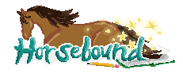

 

 Stardew meets Ranch of Rivershine meets Visual Novel/RPG in this top down 2D pixel art game. My first game I've made in 14 years since my freshman DigiPen class... lets try this! 

 Engine: Godot 4

A lot of free to use and bought assets are used in this project. The most notable of the assets are below.
- Horse and Rider Sprites: [Onfe](https://onfe.itch.io/horse-sprite-with-rider-asset-pack)
- BG Tilesets: [RafaelMatos](https://rafaelmatos.itch.io/epic-rpg-world-pack-grass-land)
